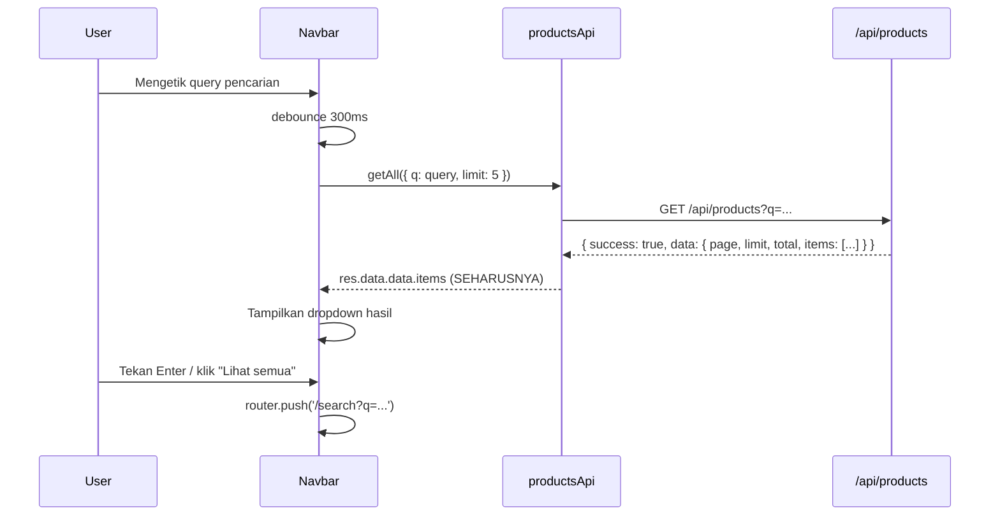
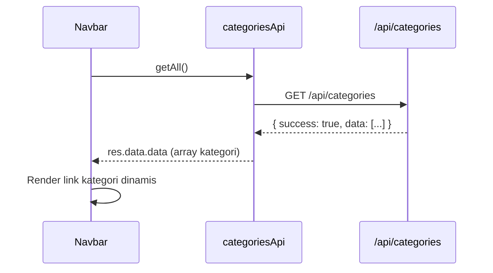
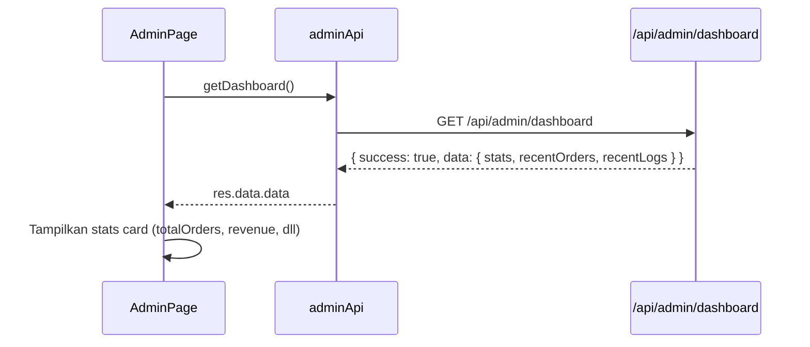

# Dokumen Desain: Frontend-Backend Integration

## Overview

Fitur ini bertujuan memperbaiki semua koneksi antara lapisan frontend (React/Next.js) dan backend (API Routes + Prisma + Supabase) pada proyek SneakerLocal. Saat ini terdapat lima titik kegagalan: normalisasi respons API yang salah pada pencarian Navbar, link kategori Navbar yang dikodekan keras (hardcoded), fallback ke data mock yang tidak perlu dihapus pada halaman Home dan Search, Admin Dashboard yang tidak memanfaatkan endpoint statistik yang sudah ada, serta parameter URL pencarian yang tidak sinkron antara Navbar dan halaman Search.

Pendekatan perbaikan berfokus pada: (1) menyeragamkan cara konsumsi format respons API di sisi klien, (2) menghapus data mock sebagai fallback setelah koneksi nyata dipastikan berjalan, dan (3) menghubungkan komponen UI ke endpoint yang tepat sesuai kontrak respons masing-masing route.

---

## Architecture

```mermaid
graph TD
    subgraph Frontend
        A[Navbar.tsx] -->|search inline + category links| B[productsApi / categoriesApi]
        C[page.tsx - Home] -->|listCatalog| D[productsApi]
        E[search/page.tsx] -->|getAll + URL params| D
        F[admin/page.tsx] -->|adminApi.getDashboard| G[adminApi]
    end

    subgraph API Layer - src/lib/api.ts
        B
        D
        G
    end

    subgraph Backend - Next.js API Routes
        B -->|GET /api/products| H[/api/products/route.ts]
        B -->|GET /api/categories| I[/api/categories/route.ts]
        D -->|GET /api/products/all| J[/api/products/all/route.ts]
        G -->|GET /api/admin/dashboard| K[/api/admin/dashboard/route.ts]
    end

    subgraph Response Contracts
        H -->|{ success, data: { page, limit, total, items } }| L[Wrapped]
        I -->|{ success, data: [...] }| L
        J -->|{ items: [...] }| M[Raw]
        K -->|{ success, data: { stats, recentOrders, recentLogs } }| L
    end
```

---

## Diagram Alur Utama

### Alur 1: Pencarian Navbar



### Alur 2: Kategori Navbar Dinamis



### Alur 3: Admin Dashboard Stats



---

## Components and Interfaces

### Komponen 1: Navbar.tsx

**Tujuan**: Menyediakan navigasi utama, pencarian inline dengan dropdown, dan link kategori dinamis.

**Antarmuka Baru**:
```typescript
// State tambahan yang diperlukan
interface NavbarState {
  categories: NavCategory[];        // mengganti NAV_LINKS hardcoded
  categoriesLoading: boolean;
}

interface NavCategory {
  id: string;
  name: string;
  slug: string;
}
```

**Fungsi yang Diperbaiki**:
```typescript
// SEBELUM (salah):
const all = res.data?.products ?? res.data?.items ?? res.data?.itemsList ?? res.data ?? [];

// SESUDAH (benar — /api/products wrapper):
const items = res.data?.data?.items ?? [];

// Navigasi ke search page saat tekan Enter:
const handleSearchSubmit = (e: React.KeyboardEvent) => {
  if (e.key === 'Enter' && searchQuery.trim()) {
    router.push(`/search?q=${encodeURIComponent(searchQuery.trim())}`);
    setIsSearchOpen(false);
    setSearchQuery('');
  }
};

// Tombol "Lihat semua":
<Link href={`/search?q=${encodeURIComponent(searchQuery)}`}>
  Lihat semua hasil untuk "{searchQuery}"
</Link>
```

**Tanggung Jawab**:
- Fetch kategori dari `/api/categories` saat mount
- Normalisasi respons `{ success, data: [...] }` menjadi array kategori
- Perbaiki pembacaan `res.data?.data?.items` untuk search
- Tambah navigasi ke `/search?q=...` saat Enter atau klik "Lihat semua"
- Render link kategori secara dinamis dari state, bukan dari konstanta hardcoded

---

### Komponen 2: page.tsx (Home)

**Tujuan**: Menampilkan katalog produk dengan filter; menggunakan data nyata dari backend.

**Perbaikan**:
```typescript
// SEBELUM: fallback ke mockProducts saat API error
} catch (err: any) {
  setProducts(mockWithFilter);   // ← DIHAPUS
  setIsFromMock(true);           // ← DIHAPUS
}

// SESUDAH: tampilkan pesan error saja
} catch (err: any) {
  setError('Gagal memuat produk. Silakan coba lagi.');
  setProducts([]);
}
```

**Normalisasi sudah benar** — `parseProductsList(response.data)` menangani `{ items: [...] }` melalui `parseListPayload`.

**Tanggung Jawab**:
- Hapus semua referensi ke `mockProducts` dan `isFromMock`
- Tampilkan error state yang informatif saat fetch gagal
- Pertahankan logika filter yang sudah ada (sudah benar)

---

### Komponen 3: search/page.tsx

**Tujuan**: Halaman katalog/pencarian yang sinkron dengan URL params.

**Perbaikan**:
```typescript
// Baca parameter 'q' dari URL (dari Navbar search)
const search = params.get('q')?.toLowerCase()   // GANTI dari params.get('search')
             ?? params.get('search')?.toLowerCase()  // fallback untuk kompatibilitas
             ?? '';

// Kirim ke API dengan parameter yang tepat
const requestParams: Record<string, string | number> = { limit: 100 };
if (search) requestParams.q = search;   // sudah benar, pastikan konsisten
```

**Tanggung Jawab**:
- Baca `?q=` (dari Navbar) maupun `?search=` (dari filter sidebar) sebagai sumber query teks
- Hapus fallback ke `mockProducts`
- Sinkronkan parameter URL dengan request ke `/api/products`

---

### Komponen 4: admin/page.tsx

**Tujuan**: Dashboard admin dengan statistik lengkap dari endpoint khusus.

**Antarmuka Data**:
```typescript
interface DashboardStats {
  totalOrders: number;
  totalUsers: number;
  totalActiveProducts: number;
  totalRevenue: number;
  pendingConfirmationCount: number;
}

interface DashboardData {
  stats: DashboardStats;
  recentOrders: Order[];
  recentLogs: AdminLog[];
}
```

**Perbaikan**:
```typescript
// SEBELUM: hanya fetch orders
const response = await ordersApi.getAllOrders({ limit: 100 });
setOrders(parseOrdersList(response.data));

// SESUDAH: fetch dashboard stats + orders
const dashRes = await adminApi.getDashboard();
const dashData = dashRes.data?.data;        // { stats, recentOrders, recentLogs }
setStats(dashData?.stats ?? defaultStats);
setOrders(parseOrdersList(dashData?.recentOrders ?? []));
```

**Tanggung Jawab**:
- Tambah `adminApi.getDashboard()` ke `src/lib/api.ts`
- Tampilkan stats card: totalOrders, totalUsers, totalActiveProducts, totalRevenue, pendingConfirmationCount
- Tetap pertahankan fitur filter status dan export

---

### Modul 5: src/lib/api.ts

**Penambahan**:
```typescript
// ─── Admin API ────────────────────────────────────────────────────────────────
export const adminApi = {
  getDashboard: () =>
    isMockApiEnabled()
      ? mockHandlers.getDashboard?.() ?? Promise.resolve({ data: { success: true, data: { stats: {}, recentOrders: [], recentLogs: [] } } })
      : api.get('/api/admin/dashboard'),
};
```

---

## Data Models

### Model 1: Respons `/api/products` (wrapped)

```typescript
interface ProductsListResponse {
  success: boolean;
  message: string;
  data: {
    page: number;
    limit: number;
    total: number;
    items: Product[];
  };
}
// Akses items: res.data.data.items
```

**Aturan Normalisasi**:
- Gunakan `res.data?.data?.items` bukan `res.data?.items`
- Jika tidak ada, default ke array kosong `[]`

### Model 2: Respons `/api/products/all` (raw)

```typescript
interface ProductsAllResponse {
  items: Product[];
}
// Akses items: res.data.items (sudah ditangani parseListPayload)
```

**Aturan Normalisasi**:
- `parseListPayload` sudah menangani `{ items: [...] }` — **tidak perlu diubah**

### Model 3: Respons `/api/categories` (wrapped)

```typescript
interface CategoriesResponse {
  success: boolean;
  message: string;
  data: Array<{
    id: string;
    name: string;
    slug: string;
    isActive: boolean;
  }>;
}
// Akses array: res.data.data
```

### Model 4: Respons `/api/admin/dashboard` (wrapped)

```typescript
interface AdminDashboardResponse {
  success: boolean;
  message: string;
  data: {
    stats: {
      totalOrders: number;
      totalUsers: number;
      totalActiveProducts: number;
      totalRevenue: number;
      pendingConfirmationCount: number;
    };
    recentOrders: Order[];
    recentLogs: AdminLog[];
  };
}
// Akses stats: res.data.data.stats
```

---

## Error Handling

### Skenario 1: API Tidak Tersedia

**Kondisi**: Fetch ke API route gagal (network error, 500, timeout)
**Respons**: Tampilkan pesan error yang ramah pengguna, jangan tampilkan data mock
**Pemulihan**: Tampilkan tombol "Coba Lagi" yang memanggil ulang fungsi fetch

### Skenario 2: Struktur Respons Tidak Sesuai

**Kondisi**: API mengembalikan format yang tidak terduga (mis. `data` adalah null)
**Respons**: Gunakan optional chaining dengan default value (`?? []`)
**Pemulihan**: Komponen render state kosong (empty state) dengan pesan informatif

### Skenario 3: Kategori Gagal Dimuat di Navbar

**Kondisi**: `/api/categories` gagal
**Respons**: Navbar tetap render tanpa link kategori (graceful degradation)
**Pemulihan**: Retry tidak otomatis; pengguna bisa refresh halaman

### Skenario 4: Dashboard Stats Gagal

**Kondisi**: `/api/admin/dashboard` return error atau struktur tidak lengkap
**Respons**: Tampilkan nilai default (0) pada stats card
**Pemulihan**: Tampilkan pesan error di bawah stats card

---

## Testing Strategy

### Pendekatan Unit Testing

Uji fungsi normalisasi di `api-helpers.ts` dengan input yang bervariasi:
- `parseListPayload` dengan berbagai bentuk response (wrapped, raw, array langsung)
- `normalizeProduct` dengan data yang lengkap dan parsial
- Pembacaan `res.data?.data?.items` yang benar vs salah

### Pendekatan Property-Based Testing

**Library**: fast-check

Properti yang dapat diuji dengan PBT:
- Untuk sembarang objek respons API yang valid, fungsi normalisasi harus menghasilkan array (tidak pernah throw)
- Round-trip: produk yang dinormalisasi harus memiliki field wajib yang terdefinisi

### Pendekatan Integration Testing

- Uji setiap halaman (Navbar, Home, Search, Admin) dengan MSW (Mock Service Worker) yang mensimulasikan respons API nyata
- Verifikasi bahwa komponen tidak jatuh ke data mock saat API tersedia

---

## Pertimbangan Performa

- Fetch kategori di Navbar dilakukan sekali saat mount, hasilnya di-cache dalam state React
- Debounce 300ms pada pencarian Navbar sudah ada dan dipertahankan
- Pencarian di Navbar menggunakan `getAll` dengan `limit: 5` untuk membatasi data yang diambil

---

## Pertimbangan Keamanan

- Endpoint `/api/admin/dashboard` sudah dilindungi `requiredRoles: ['ADMIN', 'STAFF']` di backend
- Frontend tetap memvalidasi `session.user.role === 'ADMIN'` sebelum render konten admin
- Tidak ada token yang disimpan di localStorage (sudah menggunakan HttpOnly cookies)

---

## Dependensi

- `axios` — HTTP client (sudah ada)
- `next-auth` — session management (sudah ada)
- `zustand` — cart state (tidak terpengaruh)
- `fast-check` — library PBT untuk pengujian (perlu instalasi jika belum ada)

---

## Correctness Properties

*Properti adalah karakteristik atau perilaku yang harus selalu benar di seluruh eksekusi sistem yang valid — pernyataan formal tentang apa yang seharusnya dilakukan sistem.*

### Properti 1: Normalisasi Respons API Berjenis Konsisten

*Untuk sembarang* bentuk respons API yang valid (wrapped `{ success, data: { items } }`, raw `{ items }`, atau array langsung), fungsi `parseProductsList` harus selalu menghasilkan `Product[]` — tidak pernah `undefined`, tidak pernah throw exception.

**Memvalidasi: Persyaratan 1.2, 3.1**

### Properti 2: Pencarian Navbar Selalu Membaca dari Wrapper yang Benar

*Untuk sembarang* query pencarian yang dikirim ke `/api/products`, komponen Navbar harus membaca hasil dari `res.data.data.items` dan menghasilkan array (bisa kosong, tidak boleh undefined/null).

**Memvalidasi: Persyaratan 1.1, 1.2**

### Properti 3: Kategori Navbar Mencerminkan Data dari Database

*Untuk sembarang* daftar kategori yang dikembalikan oleh `/api/categories`, Navbar harus merender link sejumlah kategori aktif yang dikembalikan API — bukan daftar hardcoded.

**Memvalidasi: Persyaratan 2.1, 2.2**

### Properti 4: URL Search Parameter Sinkron Antar Komponen

*Untuk sembarang* query teks yang dimasukkan di Navbar, redirect ke `/search?q=...` harus menghasilkan halaman Search yang membaca parameter tersebut dan meneruskannya ke API sebagai `?q=...`.

**Memvalidasi: Persyaratan 5.1, 5.4**

### Properti 5: Admin Stats Berasal dari Endpoint Dashboard

*Untuk sembarang* state sesi admin yang valid, nilai stats yang ditampilkan (totalOrders, totalRevenue, dll.) harus bersumber dari `res.data.data.stats` milik `/api/admin/dashboard`, bukan kalkulasi manual dari array orders yang difilter.

**Memvalidasi: Persyaratan 4.1, 4.2**
